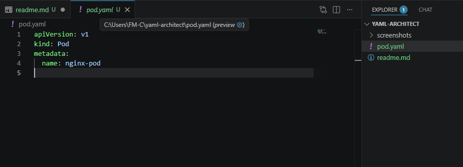
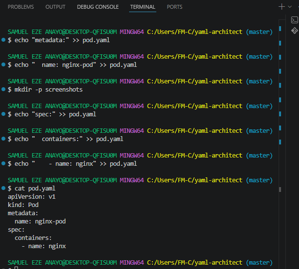
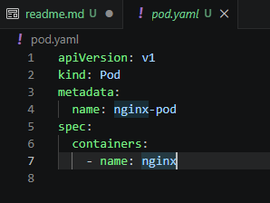

# Kubernetes YAML Architect

## Project Overview

The **Kubernetes YAML Architect** project is a hands-on exercise focused on creating and managing Kubernetes resource manifests using YAML. The project demonstrates how to define a Kubernetes Pod, work with API versions and resource types, and build a valid manifest step by step.

## 🎯 Project Objectives

- Create a Kubernetes Pod manifest using YAML.
- Understand the basic structure of a Kubernetes manifest.
- Configure an Nginx Pod.
- Practice YAML syntax and indentation.
- Use command-line tools to manage project files.
- Track the project using Git and GitHub.

## 🛠️ Technologies & Tools

- Kubernetes
- YAML
- Nginx
- Git
- GitHub
- Git Bash
- Visual Studio Code


## **Step 1 — Create the Project Directory Create the Project Directory & Initialize Git**
```bash
mkdir -p ~/yaml-architect && cd ~/yaml-architect
git init
```
## **Step 2 — Define the Kubernetes API Version**

Create the `pod.yaml` file and specify the **Kubernetes API version**.

```bash
echo "apiVersion: v1" > pod.yaml
```

## **Step 3 — Define the Kubernetes Resource Kind**

Specify the Kubernetes resource as a **Pod**.

```bash
echo "kind: Pod" >> pod.yaml
```

## **Step 4 — Add Pod Metadata**

Add the `metadata` section to the Kubernetes Pod manifest.

```bash
echo "metadata:" >> pod.yaml
```

## **Step 5 — Set the Pod Name**

Assign the name **nginx-pod** to the Kubernetes Pod.

```bash
echo "  name: nginx-pod" >> pod.yaml
```

## **Step 6 — Verify the Pod Manifest**

Display the contents of `pod.yaml` to verify the configuration created so far.

```bash
cat pod.yaml
```
outcome
```
apiVersion: v1
kind: Pod
metadata:
  name: nginx-pod
```

### Screenshot 01 — Kubernetes Pod Manifest



## **Step  7 - Lists and Arrays (Containers)**

### Define the Pod Specification

```bash
echo "spec:" >> pod.yaml
echo "  containers:" >> pod.yaml
echo "    - name: nginx" >> pod.yaml
```
#### Add First Container Item

The hyphen (`-`) indicates an item in a YAML list. This starts the first container in the `containers` list.

```bash
echo "  - name: nginx" >> pod.yaml
```
### Screenshot 02 — Container List

Run:

```bash
cat pod.yaml
```

Capture the terminal output showing the current Pod manifest.



### Screenshot 02 — Container List



## Key Concepts & Skills Demonstrated

- Kubernetes Pod manifest creation using YAML
- Understanding `apiVersion` and `kind`
- Kubernetes resource metadata and naming
- YAML indentation and hierarchical structure
- Lists and arrays using the `-` syntax
- Defining containers within a Pod
- Container image configuration
- NGINX container deployment
- Git repository initialization and version control
- Command-line YAML file creation and management
- Manifest verification using terminal commands

## 🎯 Conclusion

The **Kubernetes YAML Architect** project demonstrated how to create and structure a Kubernetes Pod manifest using YAML. The project covered key Kubernetes fields such as `apiVersion`, `kind`, `metadata`, and `spec`, while providing practical experience with YAML syntax and command-line configuration.

## **Step 7 — Git Version Control Workflow**

Use Git to stage the project files, create a commit, connect the **YAML Architect** GitHub repository, and push the project.

```bash
 1. Stage all changes
git add .
```
```
 2. Commit manifest snapshot
git commit -m "feat: create nginx pod YAML manifest"
```
```
 3. Link remote repository & push
git branch -M main
git remote add origin https://github.com/samueleze1/YAML-Architect.git
git push -u origin main
```